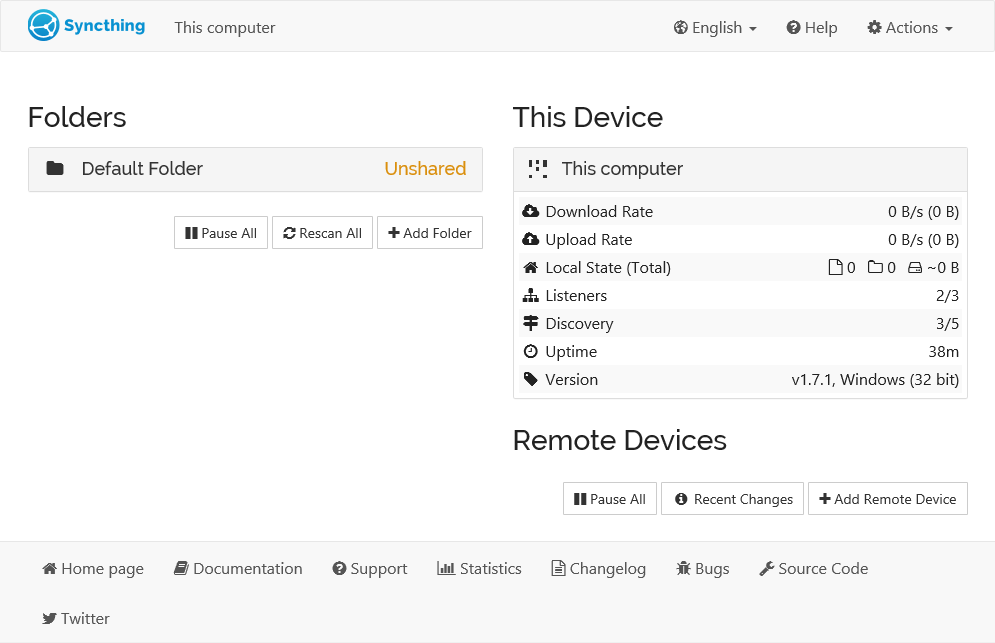

<!--
N.B.: This README was automatically generated by <https://github.com/YunoHost/apps/tree/master/tools/readme_generator>
It shall NOT be edited by hand.
-->

# Syncthing for YunoHost

[](https://dash.yunohost.org/appci/app/syncthing)  

[](https://install-app.yunohost.org/?app=syncthing)

*[Read this README in other languages.](./ALL_README.md)*

> *This package allows you to install Syncthing quickly and simply on a YunoHost server.*  
> *If you don't have YunoHost, please consult [the guide](https://yunohost.org/install) to learn how to install it.*

## Overview

Syncthing is a continuous file synchronization program. It synchronizes files between two or more computers in real time, safely protected from prying eyes. Your data is your data alone and you deserve to choose where it is stored, whether it is shared with some third party, and how it's transmitted over the internet.


**Shipped version:** 1.27.7~ynh1

## Screenshots



## Documentation and resources

- Official app website: <https://syncthing.net>
- Official user documentation: <https://docs.syncthing.net>
- Upstream app code repository: <https://github.com/syncthing/syncthing>
- YunoHost Store: <https://apps.yunohost.org/app/syncthing>
- Report a bug: <https://github.com/YunoHost-Apps/syncthing_ynh/issues>

## Developer info

Please send your pull request to the [`testing` branch](https://github.com/YunoHost-Apps/syncthing_ynh/tree/testing).

To try the `testing` branch, please proceed like that:

```bash
sudo yunohost app install https://github.com/YunoHost-Apps/syncthing_ynh/tree/testing --debug
or
sudo yunohost app upgrade syncthing -u https://github.com/YunoHost-Apps/syncthing_ynh/tree/testing --debug
```

**More info regarding app packaging:** <https://yunohost.org/packaging_apps>
