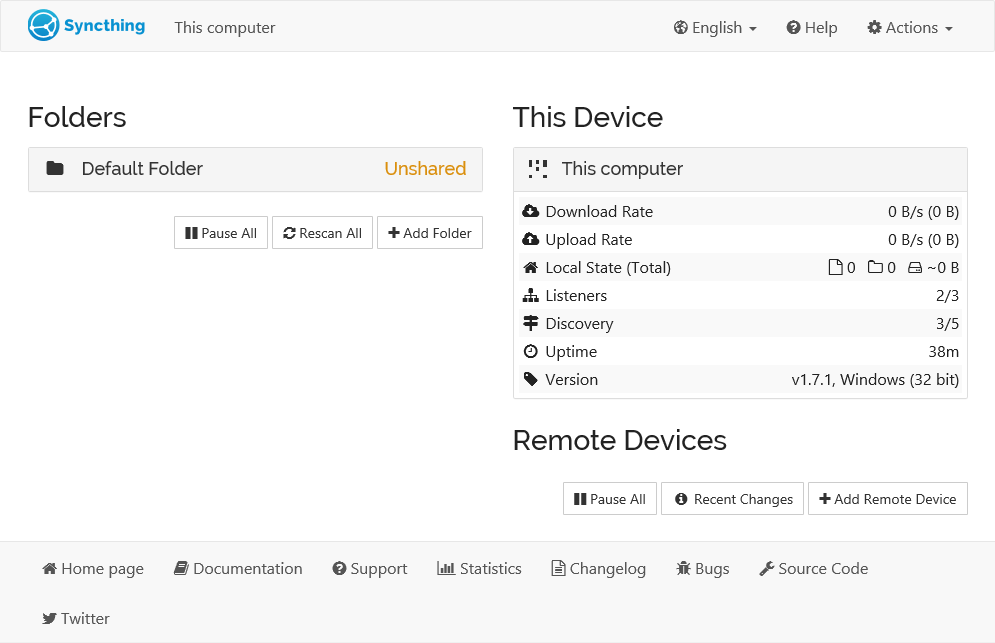

<!--
NB: Deze README is automatisch gegenereerd door <https://github.com/YunoHost/apps/tree/master/tools/readme_generator>
Hij mag NIET handmatig aangepast worden.
-->

# Syncthing voor Yunohost

[](https://ci-apps.yunohost.org/ci/apps/syncthing/)


[](https://install-app.yunohost.org/?app=syncthing)

*[Deze README in een andere taal lezen.](./ALL_README.md)*

> *Met dit pakket kun je Syncthing snel en eenvoudig op een YunoHost-server installeren.*  
> *Als je nog geen YunoHost hebt, lees dan [de installatiehandleiding](https://yunohost.org/install), om te zien hoe je 'm installeert.*

## Overzicht

Syncthing is a continuous file synchronization program. It synchronizes files between two or more computers in real time, safely protected from prying eyes. Your data is your data alone and you deserve to choose where it is stored, whether it is shared with some third party, and how it's transmitted over the internet.


**Geleverde versie:** 1.29.0~ynh1

## Schermafdrukken



## Documentatie en bronnen

- Officiele website van de app: <https://syncthing.net>
- Officiele gebruikersdocumentatie: <https://docs.syncthing.net>
- Upstream app codedepot: <https://github.com/syncthing/syncthing>
- YunoHost-store: <https://apps.yunohost.org/app/syncthing>
- Meld een bug: <https://github.com/YunoHost-Apps/syncthing_ynh/issues>

## Ontwikkelaarsinformatie

Stuur je pull request alsjeblieft naar de [`testing`-branch](https://github.com/YunoHost-Apps/syncthing_ynh/tree/testing).

Om de `testing`-branch uit te proberen, ga als volgt te werk:

```bash
sudo yunohost app install https://github.com/YunoHost-Apps/syncthing_ynh/tree/testing --debug
of
sudo yunohost app upgrade syncthing -u https://github.com/YunoHost-Apps/syncthing_ynh/tree/testing --debug
```

**Verdere informatie over app-packaging:** <https://yunohost.org/packaging_apps>
